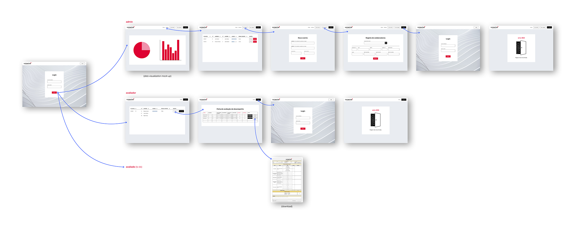

# Vicaima Performance Dialogue Platform

_HR Platform developed in a 3-day period, during the Hackathon promoted by Vicaima and 42 Porto (13 - 16 May 2024)._

___

### Table of contents
[Challenge](#rocket-challenge) · [Approach](#approach) · [Features](#features) · [Technologies used](#technologies-used) · [Next steps](#next-steps) · [Credits](#credits) · [License](#license)

___

 

# :rocket: Challenge

To design and implement a platform to facilitate the performance evaluation process within the organization, improving its efficiency through better communication and data handling.

 

## Approach

A user-friendly digital platform that supports three distinct roles, each with its own set of features tailored to their responsibilities:
`Admin (HR)`, `Assessor`, and `Assessed Employee`.

 

<i>Prototype + User flow chart.</i>

 

## Features

<table>
  <tr>
    <th>Admin (HR)</th>
    <th>Assessor</th>
    <th>Assessed Employee</th>
  </tr>
  <tr>
    <td>
      <ul>
        <li>Mass data upload (.csv) for employees;</li>
        <li>Create and management of assessment events;</li>
        <li>Monitor ongoing assessments;</li>
        <li>Delete employee data.</li>
      </ul>
    </td>
    <td>
      <ul>
        <li>Access to active assessment events;</li>
        <li>View employee performance data;</li>
        <li>Assess employees and communicate the results.</li>
      </ul>
    </td>
    <td>
      <ul>
        <li>Confirm knowledge of evaluations;</li>
        <li>View performance feedback from assessors.</li>
      </ul>
    </td>
  </tr>
</table>

 

## Technologies Used
- **Backend**: Built using `Django` with `SQLite` for data storage and management.
- **Security**: Implemented role-based access control and secure data handling using `Django`’s security features.
- **Frontend**: A clean and user-friendly interface to mediate interaction between users and the platform developed in `Figma`. Data views are customized based on the user’s role.

 

## Current Status
The core functionalities of the platform have been implemented, including role-based access, performance evaluation event management, and employee data handling. We have developed a consistent user-experience through a design system that ensures interface clarity and ease of use.

 

## Next Steps
<table>
  <tr>
    <th>🔴 Short-term</th>
    <th>🟡 Mid-term</th>
    <th>🟢 Long-term</th>
  </tr>
  <tr>
    <td>Implement a data dashboard for enhanced visualization of organizational performance data and a mechanism for evaluated users to confirm their knowledge of evaluation results.</td>
    <td>Add additional features to enhance each role's capabilities.</td>
    <td>Continuously adapt the platform to meet Vicaima’s specific organizational needs by introducing new variables and features.</td>
  </tr>
</table>

___

 

### Credits
Lucas Medeiros [@Lucas42Porto](https://github.com/Lucas42Porto)

Luís Balsa [@LuisBalsa](https://github.com/LuisBalsa)

Rui Pires [@Rui-Pedro-Pires](https://github.com/Rui-Pedro-Pires)

Teresa Chow (me)
___

 

### License
This work is published under the terms of the [GNU General Public License](./LICENSE).

 

[⬆ back to top](#vicaima-performance-dialogue-platform)
